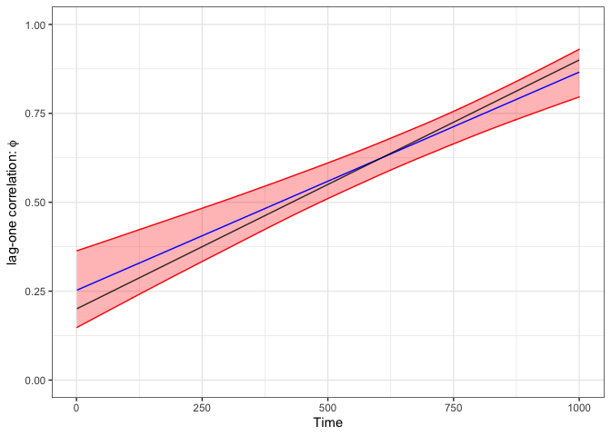

<!-- README.md is generated from README.Rmd. Please edit that file -->

# INLA.ews

<!-- badges: start -->

[](https://github.com/eirikmn/INLA.ews/actions/workflows/R-CMD-check.yaml)
[](https://www.gnu.org/licenses/old-licenses/gpl-2.0.en.html)
<!-- badges: end -->

This Repository contains the INLA.ews package for Bayesian detection of
early warning signals.

When a dynamical system approaches a bifurcation point the state
variable exhibits increased correlation and variance, this is also known
as critical slowing down. Our model assumes that the memory coefficient
increases linearly as a function of time, and uses the [R-INLA
package](https://www.r-inla.org) to obtain the posterior marginal
distributions. Of particular interest is the slope parameter which
indicate whether or not correlation is increasing.

INLA.ews currently supports time-dependent AR(1) and fGn processes,
although the latter is far more computationally costly.

## Installation

You can install the development version of INLA.ews from
[GitHub](https://github.com/) with:

``` r
# install.packages("devtools")
devtools::install_github("eirikmn/INLA.ews")
```

## Example

This is a basic example which shows you how to use the package to
perform Bayesian analysis of a simulated time series which exhibit early
warning signals in the form of increasing correlation.

``` r
library(INLA.ews)

# Set seed and parameters
set.seed(0)
n = 1000
sigma = 1
a=0.2
b=0.7/n
time = 1:n
phis = a+b*time

# Simulate time dependent process
data=numeric(n)
data[1] = rnorm(1,mean=0,sd=sigma)
for(i in 2:n){
  data[i] = rnorm(1, mean=phis[i]*data[i-1],sd=sigma)
}

# Run inla.ews
object = inla.ews(data,model="ar1", memory.true=phis)
```

The plot below shows the estimated posterior marginal mean for the
lag-one correlation coefficient (blue) in the above example, with 95%
credible intervals included (red). The black line represents the ‘true’
development of the memory.



## Attribution

This code is associated and written for an upcoming paper. Feel free to
use the code, but please cite the accompanying paper (when it is
published).

## License

The code in this repository is made available under the terms of the GNU
General Public License (GPL) version 2 License. For details, see
LICENSE.md file.
